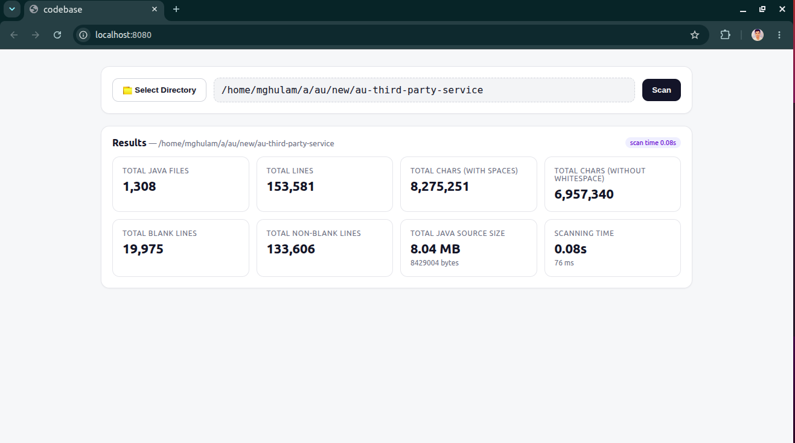
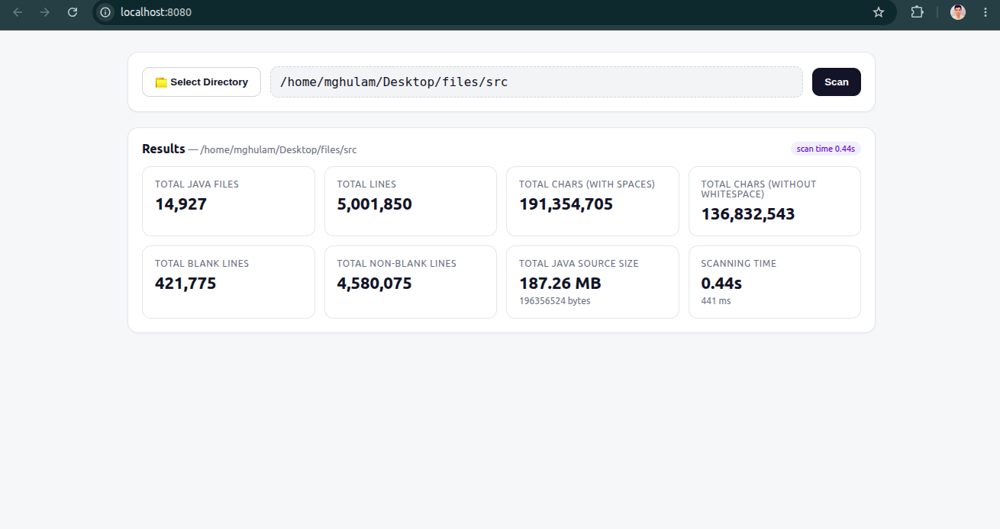

A simple tool to scan and analyze a Java codebase.

## Features

* Select a project directory
* Scan all `.java` files recursively
* Fast concurrent file processing

## Run

```bash
git clone https://github.com/ghulam2545/codebase.git
cd codebase
go run .
```

Then open:

```text
http://localhost:8080
```

### Screenshot

